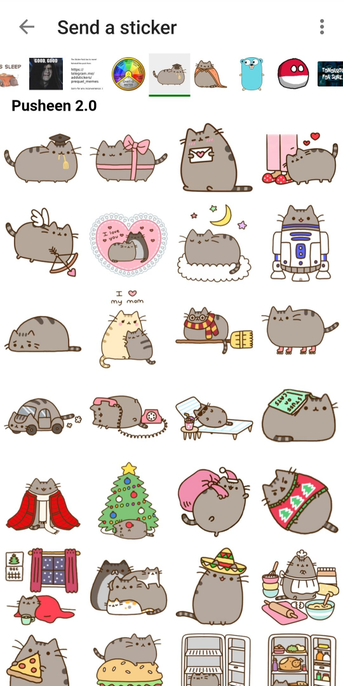
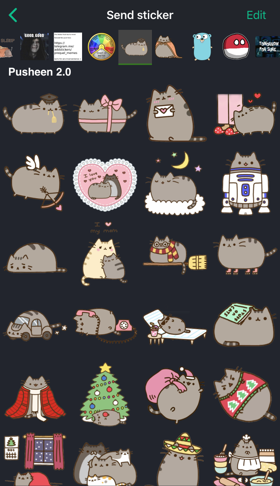

# Maunium sticker picker
被选定作为绒布球聊天室表情包的承载！
## 如何提交新表情包：
请clone本仓库并自行上传表情包并pr

*小提示：登录服务器建议选matrix.org；从telegram抓表情包需要魔法；telephon库不要太大，亲测1.18.2没问题； 最好用Linux系统*

上传时记得 **检查不要把** *config.json* 和 *sticker-import.session* 传上来（貌似默认ignore，这俩是登录信息！）

下面的是原来的介绍：

## Instructions
For setup and usage instructions, please visit the [wiki](https://github.com/maunium/stickerpicker/wiki):

* [Creating packs](https://github.com/maunium/stickerpicker/wiki/Creating-packs)
* [Enabling the widget](https://github.com/maunium/stickerpicker/wiki/Enabling-the-widget)
* [Hosting on GitHub pages](https://github.com/maunium/stickerpicker/wiki/Hosting-on-GitHub-pages)

If you prefer video tutorials, [Brodie Robertson](https://www.youtube.com/c/BrodieRobertson) has made a great video on setting up the picker and creating some packs: https://youtu.be/Yz3H6KJTEI0.

## Comparison with other sticker pickers

* Scalar is the default integration manager in Element, which can't be self-hosted and only supports predefined sticker packs.
* [Dimension](https://github.com/turt2live/matrix-dimension) is an alternate integration manager. It can be self-hosted, but it's more difficult than Maunium sticker picker.
* Maunium sticker picker is just a sticker picker rather than a full integration manager. It's much simpler than integration managers, but currently has to be set up manually per-user.

| Feature                         | Scalar | Dimension | Maunium sticker picker |
|---------------------------------|--------|-----------|------------------------|
| Free software                   | ❌     | ✔️        | ✔️                     |
| Custom sticker packs            | ❌     | ✔️        | ✔️                     |
| Telegram import                 | ❌     | ✔️        | ✔️                     |
| Works on Element mobiles        | ✔️     | ❌        | ✔️                     |
| Easy multi-user setup           | ✔️     | ✔️        | ❌[#7][#7]  |
| Frequently used stickers at top | ❌     | ❌        | ✔️                     |

[#7]: https://github.com/maunium/stickerpicker/issues/7

## Preview
### Element Web

### Element Android

### Element iOS (dark theme)

